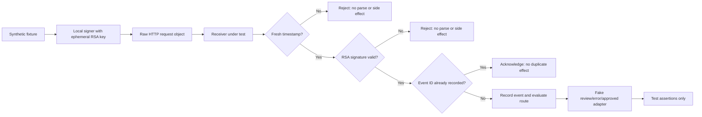

# Offline Webhook Validation Protocol: Manus → Verifier → Zapier

**Document status:** Proposed protocol; no live-provider test has been run

**Version:** 1.0.0

**Research checked:** 2026-08-18

## 1. Purpose and Evidence Boundary

This protocol tests the **implementation of a controlled webhook receiver** without a live Manus or Zapier workspace. It uses synthetic payloads, an ephemeral locally generated RSA keypair, a fake side-effect adapter, and a disposable in-memory event ledger. It can prove that the receiver preserves raw bytes, reconstructs the documented signing string, enforces a freshness rule, rejects bad signatures, prevents a duplicate event from invoking the fake side effect twice, and routes unsupported outcomes to review.

It cannot prove that Manus currently delivers a specific event to a real URL, that Manus signs with a specific live key, that a Zapier account exposes a particular field, that a Catch Raw Hook preserves exactly the bytes expected by the receiver, or that an authenticated app connection is configured correctly. Those are **live-workspace assertions** and remain subject to the future test cards in the [Experimental Validation Ledger](validation-ledger.md). [1] [2] [4]

| Assertion | Offline fixture test | Authorized live-workspace test |
| --- | --- | --- |
| Receiver reconstructs and verifies the expected RSA-SHA256 signing input | Yes | Yes |
| Receiver uses raw bytes rather than parsed/reserialized JSON | Yes | Yes |
| Receiver rejects stale, malformed, missing-header, and invalid-signature inputs | Yes | Yes |
| Receiver records and deduplicates `event_id` before a side effect | Yes | Yes |
| Receiver handles `finish`, `ask`, error, and structured-output failure policy | Yes | Yes |
| Manus calls the configured endpoint with its live public key | No | Yes |
| Zapier’s native trigger or Catch Raw Hook maps the observed fields as expected | No | Yes |
| A Manus webhook registration is accepted and persists | No | Yes |
| Production latency, retries, routing, permissions, and ownership transfer behavior | No | Yes |

> **Evidence label.** A passed run of this protocol is **local implementation validation**, not “observed in test” evidence for the Manus or Zapier platforms. The manual should retain the label **documented** until an authorized synthetic-data live test is completed.

## 2. Source Contract Under Test

Manus documents that each webhook request includes `X-Webhook-Signature` and `X-Webhook-Timestamp`; the receiver should reject requests older than five minutes; and the RSA-SHA256 verification input is composed as:

```text
{timestamp}.{full_webhook_url}.{sha256_hex_of_raw_request_body}
```

The documented receiver must retrieve the public key through the webhook public-key endpoint, cache it rather than retrieve it on every request, and verify the raw request before processing it. [1] [2]

For local testing, replace the Manus public key with an **ephemeral test public key** generated at the start of the run. Never fabricate a live Manus key, use a real production key, create a live webhook registration, or send a synthetic event to a real Zapier URL.

## 3. Test Harness Architecture

The harness should isolate verification logic from delivery and side effects. It should accept an explicit clock, URL, raw byte buffer, headers, public key, event store, and destination adapter; this makes every important input controllable by a test.



### 3.1 Minimal interfaces

| Interface | Required behavior | Test double |
| --- | --- | --- |
| `verifyRequest` | Checks headers, timestamp, exact full URL, SHA-256 raw-body hash, and RSA-SHA256 signature | Uses the ephemeral test public key |
| `clock` | Supplies the current Unix time | Fixed time controlled by each test |
| `eventStore` | Performs an atomic “record once” operation keyed by `event_id` | In-memory map that exposes write count and stored record |
| `routePolicy` | Maps valid parsed payload to `approved`, `review`, or `error` | Pure function with fixed expected route |
| `destinationAdapter` | Receives only a minimized trusted payload | Fake adapter that records calls; it never sends or changes anything externally |
| `auditLog` | Captures non-sensitive verification outcome and correlation fields | In-memory structured log; redact raw body and signatures |

### 3.2 Required invariants

The following conditions are non-negotiable test assertions.

| Invariant | Expected behavior |
| --- | --- |
| Raw-byte integrity | Verification runs on the original byte buffer, before JSON parsing or body transformation |
| Full URL integrity | A changed query parameter, scheme, host, path, or trailing path representation fails verification because it changes the signed text |
| Freshness | A timestamp outside the configured window is rejected before a route or side effect is selected |
| Authentication | Missing, malformed, or tampered signatures fail closed |
| Event idempotency | A previously recorded `event_id` produces no second destination-adapter call |
| Parse safety | Invalid JSON after a valid signature creates a controlled error record and no approved route |
| Output safety | `stop_reason: ask`, a task error, or `structured_output.success: false` becomes a review/error route, not an approved route |
| Minimal disclosure | The forwarded test payload contains only selected fields; raw source content and credential-like values are absent |

Raw-body verification and replay/idempotency controls are consistent with independent webhook-security guidance; the exact Manus algorithm and signed-string construction must follow Manus documentation. [2] [5] [6]

## 4. Synthetic Fixture Set

Use fictional, non-sensitive values. Maintain fixtures as text files encoded in UTF-8 without auto-formatting. A test should assert the exact bytes read from the fixture rather than a parsed-and-reserialized equivalent.

### 4.1 Baseline valid completion fixture

```json
{
  "event_id": "evt_test_0001",
  "event_type": "task_stopped",
  "task_detail": {
    "task_id": "task_test_0001",
    "task_title": "Synthetic triage task",
    "task_url": "https://example.invalid/tasks/task_test_0001",
    "message": "Synthetic completion for local validation only.",
    "stop_reason": "finish",
    "structured_output": {
      "success": true,
      "value": {
        "category": "product",
        "priority": "low",
        "needs_human_review": false
      },
      "error": null
    }
  }
}
```

This reflects the documented shape of a stopped-task event and structured-output container, but it is a local fixture—not a captured Manus payload. [1] [3]

### 4.2 Required mutation fixtures

| ID | Mutation | Expected result | Destination-adapter calls |
| --- | --- | --- | --- |
| F-01 | Valid completion fixture with fresh timestamp and matching signature | `200`-equivalent local success; event stored; approved route selected | 1 |
| F-02 | Same `event_id`, same valid request repeated | Success acknowledgement; no second effect | 1 total |
| F-03 | One raw-body byte changes after signing, including whitespace | Signature failure | 0 |
| F-04 | Full URL changes after signing, such as an added query parameter | Signature failure | 0 |
| F-05 | Timestamp older than the configured five-minute window | Freshness failure | 0 |
| F-06 | Malformed or missing signature header | Authentication failure | 0 |
| F-07 | Valid signature over invalid JSON bytes | Parse/error route; no approved effect | 0 |
| F-08 | `stop_reason: "ask"` with valid signature | Review route | 1 fake review item; 0 approved effects |
| F-09 | Structured output with `success: false` | Review/error route | 1 fake exception item; 0 approved effects |
| F-10 | Unexpected enum value or missing required business field | Validation/error route | 0 approved effects |
| F-11 | Array of two event objects | Reject or quarantine according to a single-event contract | 0 approved effects unless the receiver deliberately supports batch semantics |
| F-12 | Signature valid but event ID store throws | Safe error; no destination call | 0 |

## 5. Detailed Local Procedure

### Step 0 — Establish a sterile environment

Run only on a developer machine or a sandboxed local environment. Disable network egress in the test runner where practical. Configure the destination adapter as a fake object that fails the test if it tries to issue a network request. Do not load production environment variables, real API keys, production certificates, webhook URLs, browser cookies, or customer data.

### Step 1 — Create an ephemeral test identity

Generate a new 2048-bit RSA keypair at test start. Keep the private key only in process memory and destroy it when the test process ends. Pass the corresponding public key directly to `verifyRequest`. The purpose is to verify the receiver’s cryptographic implementation, not to impersonate Manus.

### Step 2 — Create the exact raw request bytes

Read the valid fixture as a byte buffer. Do not parse and pretty-print it before signing. Select a deterministic local URL, for example:

```text
https://verifier.test.local/webhooks/manus?environment=fixture
```

Select a fixed current time, then create a fresh timestamp within the configured acceptance window. Compute the SHA-256 hex digest of the raw byte buffer and concatenate the signing input exactly as Manus documents. Sign the resulting byte string with the ephemeral private key using RSA-SHA256, base64-encode the signature, and set the two documented header names. [2]

### Step 3 — Execute the baseline success test

Pass `{url, rawBody, headers, now, publicKey, eventStore, destinationAdapter}` to the receiver. Assert all of the following:

1. Verification returns success.
2. JSON parsing occurs only after verification succeeds.
3. The ledger records `evt_test_0001` exactly once.
4. The route is `approved` only because `stop_reason = finish`, structured output reports `success = true`, and the test policy accepts the selected allowlisted fields.
5. The fake destination adapter is called once with a minimized trusted payload.
6. The audit log records a correlation ID and outcome, but not the raw body, signature, or private key.

### Step 4 — Run integrity and authentication mutations

Execute F-03 through F-06 one at a time. Every mutation must fail before the receiver selects an approved route or writes a completed event record. In particular, F-03 must show why parsing then reserializing JSON is unsafe: a semantically equivalent object can have different byte representation and a different hash.

### Step 5 — Run replay and storage-failure tests

Execute F-02 and F-12. F-02 proves that the effect boundary is idempotent for the same event identity. F-12 proves the receiver fails closed when it cannot durably record its event identity. It must never invoke the destination adapter before a successful atomic record operation.

### Step 6 — Run business-policy tests

Execute F-08 through F-11. These tests validate the separation between transport authenticity and business authorization. A valid cryptographic signature proves the sender authentication and request integrity; it does not make the content appropriate for every destination. Manus documents that a stopped task may have `finish` or `ask`, and structured output must be checked for `success`. [1] [3]

### Step 7 — Produce a local validation report

Save a concise test report that includes the protocol version, fixture IDs, runtime version, date, test-key fingerprint only, pass/fail result, route result, event-store write count, destination-adapter call count, and cleanup confirmation. It must not include the private key, actual raw signature, full payload if it may contain sensitive data, or connection details.

## 6. Suggested Pass/Fail Report

| Field | Example value |
| --- | --- |
| Protocol | `offline-webhook-validation-protocol v1.0.0` |
| Evidence label | `Local implementation validation` |
| Date/time | `2026-08-18T00:00:00Z` |
| Fixture | `F-03: raw-body mutation` |
| Expected result | `Reject before parse or route` |
| Actual result | `Rejected; no event recorded; destination calls = 0` |
| Result | `Pass` |
| Key reference | `Ephemeral key fingerprint only` |
| Environment | `Local sandbox; network disabled` |
| Cleanup | `Ephemeral key discarded; in-memory ledger destroyed` |
| Follow-up | `None` or a linked open-question ID |

## 7. Promotion Gate: Offline to Live Workspace

Do not move from a local passing result directly to a production webhook. First obtain explicit authorization for an isolated Manus and Zapier test workspace. Then execute the existing live test card EV-03 and add the following acceptance criteria.

| Live-workspace assertion | Evidence required before production |
| --- | --- |
| Manus accepts the registered disposable HTTPS callback and sends a test request | Redacted registration record and receiver access log |
| The receiver’s exact deployed URL reconstruction matches the signed request | Successful signature-validation record with no raw payload retention |
| The current public key retrieval/caching policy works | Key-cache telemetry and rotation/retrieval test evidence |
| A Catch Raw Hook or native task trigger exposes the required trusted fields | Redacted Zap test-run sample and mapped-field inventory |
| A duplicate callback does not cause a duplicate downstream effect | Event ledger and test destination count |
| `finish`, `ask`, error, and structured-output failure route correctly | Four redacted test-run records |
| Test artifacts are removed | Webhook deletion, Zap disable/delete, test-key revocation, and endpoint cleanup record |

## 8. Failure Triage

| Failed test | Likely cause | Corrective action | Do not do |
| --- | --- | --- | --- |
| F-01 baseline fails | Incorrect signing-string order, wrong URL, wrong encoding, or mismatched key | Compare the local construction byte-for-byte against the documented Manus format | Do not loosen verification until it passes |
| F-03 body mutation passes | Receiver parsed/reserialized before verifying or used the wrong bytes | Refactor to capture raw bytes at the ingress boundary | Do not accept parsed JSON as a substitute for signed bytes |
| F-04 URL mutation passes | Receiver omitted query/path/scheme/host from the signature input | Use the full external callback URL used by the sender | Do not hard-code only a path if the provider signs the full URL |
| F-05 stale timestamp passes | Freshness check is absent or clock input is uncontrolled | Add a bounded clock tolerance and inject the clock in tests | Do not rely on event ID alone for freshness when the provider supplies a signed timestamp |
| F-02 duplicates call destination twice | Event record occurs after side effect or is not atomic | Record event identity before calling the adapter and enforce uniqueness | Do not solve duplicate side effects by suppressing logs |
| F-08/F-09 routes to approved action | Route policy treats valid signature as business approval | Add explicit `stop_reason` and structured-success gates | Do not let a model outcome approve an external action |

## 9. References

[1]: https://open.manus.ai/docs/v2/webhooks-overview "Manus API v2 — Webhooks Overview"
[2]: https://open.manus.ai/docs/v2/webhooks-security "Manus API v2 — Webhook Security"
[3]: https://open.manus.ai/docs/v2/structured-output "Manus API v2 — Structured Output"
[4]: https://help.zapier.com/hc/en-us/articles/8496288690317-Trigger-Zap-workflows-from-webhooks "Zapier Help — Trigger Zap workflows from webhooks"
[5]: https://hookdeck.com/webhooks/guides/webhook-security-vulnerabilities-guide "Hookdeck — Webhook Security Vulnerabilities Guide"
[6]: https://webhooks.fyi/security/replay-prevention "Webhooks.fyi — Replay prevention"
