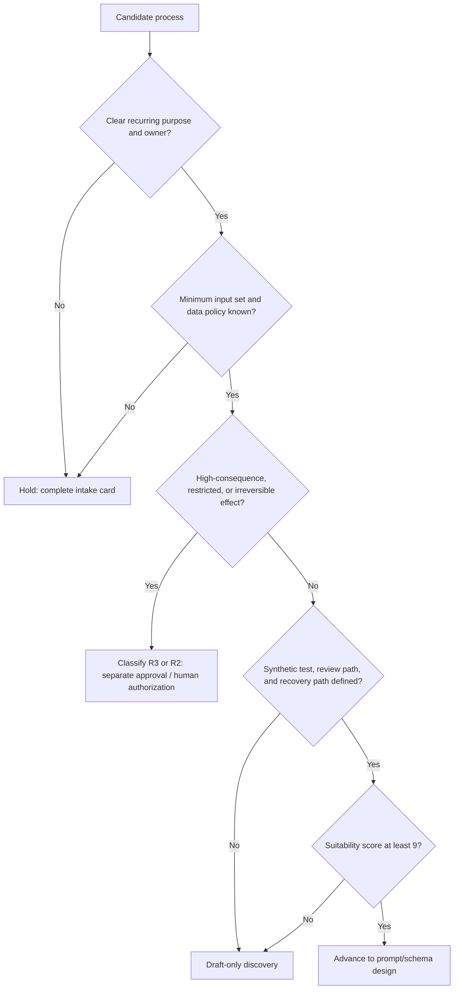

# Use-Case Portfolio and Decision Framework

**Objective:** Select Manus–Zapier opportunities that are valuable, bounded, reviewable, and operable before any workflow design begins.

**Status:** Design recommendation; illustrative portfolio only

**Evidence label:** Design recommendation grounded in risk-management guidance

**Workspace:** [Use-Case Portfolio and Decision Framework](README.md)

**Related artifacts:** [Evidence Register](../../research/evidence-register.md), [Living Documentation Governance](../../living-document-governance.md)

## 1. Decision Principle

A useful automation candidate is not automatically a suitable automation candidate. A task can be valuable but inappropriate for automation because its inputs are unstable, its outcome would have a meaningful external effect, its error cannot be reversed, or no owner can assess quality. NIST’s AI RMF describes iterative governance, context mapping, measurement, and risk management; it emphasizes documenting the intended purpose, impacts, human oversight, ownership, testing, and monitoring before proceeding. [1] [2] The OECD principles likewise support context-appropriate human oversight, robustness, accountability, and traceability. [3]

> **Portfolio rule:** Advance a candidate only when its expected benefit, bounded scope, action consequence, data controls, human oversight, testability, observability, and accountable ownership are all understood well enough to support a controlled next step.

## 2. Use-Case Intake Card

Complete this card before ranking any candidate. Unknown fields are a reason to hold the candidate for discovery, not to assume a favorable answer.

| Field | Required decision input | Example of an acceptable answer |
| --- | --- | --- |
| Business purpose | What recurring problem is being improved, for whom, and why now? | “Prepare an internal account-research brief before a seller reviews it.” |
| Trigger and frequency | What event starts the work, and how often does it occur? | “A qualified inbound request is created; expected volume is low and variable.” |
| Input map | Which fields are trusted, untrusted, sensitive, optional, or prohibited? | “Record ID and account name are trusted; free text is untrusted; personal contact details are excluded.” |
| Manus task boundary | What may the task do, and what must it never do? | “Summarize and identify missing data; never contact, publish, purchase, delete, or change a system.” |
| Output contract | What specific fields, uncertainty signals, and exception conditions are required? | “Summary, category, confidence note, and `needs_human_review`.” |
| Downstream action | What happens after output and who authorizes it? | “An internal review queue is created; account owner decides whether to act.” |
| Impact and reversibility | Who could be affected, what is the harm if wrong, and can it be corrected? | “Internal draft only; no external record changes; easily reversible.” |
| Data and policy constraints | Which data classes, retention rules, contracts, or organizational policies apply? | “No regulated/credential data; source record stays in the system of record.” |
| Owner and escalation | Who owns business quality, technical operation, and incident response? | “Sales-operations owner and automation owner named; review queue has a backup.” |
| Success and guardrail metrics | What would show improvement, and what would show unacceptable degradation? | “Reviewer usefulness score improves; unsupported claims and missed review flags remain below agreed threshold.” |
| Test and rollback | What synthetic test proves readiness, and how is the work paused/reversed? | “Synthetic records only; Zap can be paused; no external side effect exists.” |

## 3. Suitability Matrix

Score each dimension from **0 to 2**. The score helps structure discussion; it does not overrule a prohibited data type, unresolved legal/policy issue, or high-consequence action.

| Dimension | 0 — Hold or reject | 1 — Needs control or discovery | 2 — Suitable characteristic |
| --- | --- | --- | --- |
| Purpose and value | Vague objective or no identifiable user benefit | Plausible benefit, but baseline or user unclear | Specific recurring problem, named user, and measurable outcome |
| Input stability | Unbounded, ambiguous, or inaccessible source data | Some stable fields but frequent missing/variable inputs | Small, defined field set with a trusted/untrusted map |
| Data minimization | Sensitive/regulated data has no approved boundary | Some sensitive fields need redaction or policy review | Minimum fields are known; prohibited fields are excluded |
| Outcome containment | Output directly causes an irreversible or high-impact effect | Output updates an internal staging item with review required | Output is an internal draft, analysis, or review item only |
| Human oversight | No named reviewer or approval path | Reviewer exists but threshold/timing is unclear | Named reviewer, decision criteria, timeout, and escalation are defined |
| Testability | Cannot use synthetic fixtures or inspect quality | Partial fixture/test design exists | Synthetic positive, negative, and edge cases are available |
| Observability and recovery | No correlation record, owner, or safe stop procedure | Some logs exist but recovery/replay path unclear | Source/task/outcome correlations, pause control, and recovery owner are defined |

### 3.1 Score interpretation

| Total | Default recommendation | Required next step |
| --- | --- | --- |
| 0–5 | **Keep manual or reject** | Clarify purpose/data/ownership, or document why automation is not appropriate |
| 6–8 | **Draft-only discovery** | Build an intake card and synthetic examples; do not connect a downstream action |
| 9–11 | **Human-reviewed prototype candidate** | Define prompt contract, schema, review route, and operational record before a controlled test |
| 12–14 | **Controlled-test candidate** | Complete risk-tier gate, test plan, owner approval, and rollback plan; still do not activate production automatically |

## 4. Risk Tiers and Action Boundaries

The tiers are a local decision aid derived from the need to align controls with context, potential impact, human oversight, and monitoring—not a regulatory classification. [1] [2] [3]

| Tier | Typical use | Permitted automation boundary | Required controls | Do not allow |
| --- | --- | --- | --- | --- |
| **R0 — Internal preparation** | Research briefs, meeting notes, document summaries using non-sensitive internal inputs | Generate a private draft or review item | Prompt contract, source/task correlation, basic quality review, pause control | External send/publish, record deletion, sensitive-data ingestion without approval |
| **R1 — Internal routing and staging** | Categorization, metadata suggestion, exception detection, structured internal routing | Create a staging record or internal review task using allowlisted fields | Strict schema, validation, duplicate protection, clear owner, error/review path | Automatic action on customer, financial, personnel, or regulated records |
| **R2 — Human-authorized external preparation** | Customer-message drafts, content drafts, calendar proposals, CRM-change recommendations | Prepare content or a proposed change for a named human to authorize in the system of record | Human approval, recipient/context check, audit correlation, explicit reject/timeout path, rollback plan | Unattended sending, publishing, scheduling, spending, or deletion |
| **R3 — High-consequence or restricted** | Decisions about employment, credit, health, legal rights, safety, payments, access, or sensitive-data handling without a settled policy | No automation under this framework | Separate policy, legal, risk, and domain-owner review before any prototype | Treating a generic prompt or score as authorization to proceed |

> **Override rule:** Any prohibited data condition, unowned external effect, missing human review, unknown rollback path, or unresolved policy requirement moves a candidate to **hold**, regardless of numerical score.

## 5. Decision Tree



## 6. Illustrative Initial Portfolio

These are generic examples, not recommendations about the user’s current business processes. Their purpose is to demonstrate the framework and show where automation should stop.

| Candidate | Likely tier | Why it can be appropriate | Key guardrail | First artifact to create |
| --- | --- | --- | --- | --- |
| Internal company/meeting research brief | R0 | Produces a private draft for a human user; no direct external action is needed | Exclude unnecessary personal data; disclose uncertainty and sources | Prompt contract with an internal review rubric |
| Internal service-request triage suggestion | R1 | Converts bounded form data into a category and routing suggestion | Validate schema/enums; send ambiguous cases to review | Classification schema and adversarial fixture set |
| Knowledge-base gap finder | R0/R1 | Identifies topics that may need human-authored documentation | Do not publish or alter knowledge content automatically | Output policy for proposed gaps and evidence links |
| Customer-email or social-content draft | R2 | Prepares content efficiently but recipient/context judgment remains human | Named reviewer approves content, recipient, timing, and factual claims | Draft template plus approval and rejection criteria |
| Customer/account change recommendation | R2 | Can assemble a proposed internal change from validated inputs | System-of-record owner must approve; no direct automatic update | Change-proposal schema and rollback checklist |
| Employment, credit, health, legal-rights, payment, or access decision | R3 | Potentially high impact and constrained by domain-specific requirements | Keep manual under this generic framework; seek specialized governance | Restricted-use decision record |

## 7. Success Measures and Guardrails

Use measures that describe usefulness and safety together. A volume or speed metric alone can reward unsafe activity. NIST recommends selecting and documenting appropriate risk metrics and testing/monitoring methods in context. [2]

| Measure category | Example metric | Guardrail / interpretation |
| --- | --- | --- |
| User usefulness | Reviewer rating of whether a draft reduced preparation work | Never use as the sole release criterion; include factual-quality review |
| Quality | Percentage of outputs meeting a documented rubric | Segment by input type; investigate degradation and uncertainty failures |
| Review effectiveness | Percentage of uncertain/ambiguous cases correctly routed to review | A lower rate is not automatically better; missed escalation is a risk signal |
| Safety | Count of unvalidated fields reaching an approved route | Target is zero; any occurrence triggers investigation |
| Reliability | Completion/error/waiting distribution for synthetic and authorized test cases | Diagnose by failure class; do not hide errors by blind replay |
| Reversibility | Time and procedure needed to pause or correct an outcome | Must be tested before a candidate advances beyond prototype |

## 8. Handoff Record to the Other Workspaces

When a candidate advances to prompt/output design, create the following handoff record.

```text
Use-case ID:
Business purpose:
Risk tier and rationale:
Process owner / technical owner:
Trusted inputs:
Untrusted inputs:
Prohibited inputs:
Permitted Manus task:
Prohibited actions:
Required output fields:
Human-review trigger:
Downstream boundary:
Success metric:
Failure conditions:
Pause / rollback method:
Evidence IDs and open questions:
```

## 9. Open Questions and Next Iteration

| ID | Question | Next action |
| --- | --- | --- |
| UC-01 | Which three real processes should enter the portfolio first? | Obtain user-selected candidates or conduct a scoped discovery session |
| UC-02 | What data classification policy applies to proposed inputs and logs? | Obtain data/risk-owner guidance before scoring candidates with sensitive data |
| UC-03 | Which quality and safety thresholds are acceptable for each process? | Define baseline and review rubric with process owner |
| UC-04 | What is the organization’s escalation and approval model for R2/R3 candidates? | Link to operations workspace once ownership roles are confirmed |

## References

[1]: https://airc.nist.gov/airmf-resources/playbook/ "NIST AI RMF Playbook"
[2]: https://airc.nist.gov/airmf-resources/airmf/5-sec-core/ "NIST AI RMF Core"
[3]: https://www.oecd.org/en/topics/sub-issues/ai-principles.html "OECD AI Principles"
