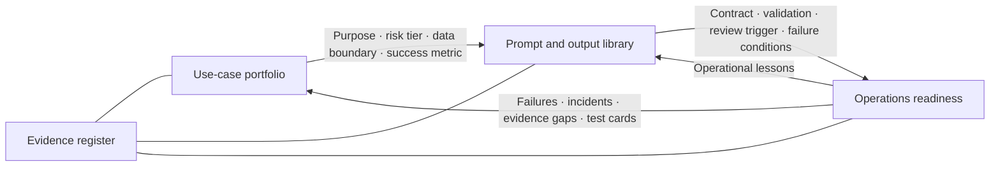

## Cover

# Living Manus–Zapier Documentation Workspaces

### Three coordinated workstreams, one evidence-driven operating model

**Prepared by Manus AI · 18 August 2026**

## Slide 1

# The workspaces turn ideas into controlled learning

- **Select**: decide whether an automation opportunity is valuable, bounded, and permitted.
- **Design**: translate an approved opportunity into safe prompt, input, and output contracts.
- **Operate**: monitor outcomes, contain failures, and feed lessons back into documentation.
- The system advances **evidence and decisions**, not unattended external actions.

## Slide 2

# Workspace A screens for suitability before design begins

- Uses a common intake card for purpose, inputs, impact, ownership, metrics, and rollback.
- Scores seven dimensions: value, input stability, data minimization, containment, oversight, testability, observability.
- Assigns risk tiers **R0–R3** to determine the permitted action boundary.
- Produces a hold, draft-only, human-reviewed prototype, controlled-test, or restricted-use recommendation.

## Slide 3

# Workspace B converts approved intent into validated contracts

- Separates **trusted context** from **untrusted business data** and excludes prohibited material.
- Provides reusable templates for triage, internal research briefs, and change proposals.
- Uses strict structured-output schemas plus four validation layers: result, schema, business semantics, destination safety.
- Tests templates with fictional adversarial, missing-data, ambiguity, and output-failure fixtures.

## Slide 4

# Workspace C makes the workflow measurable and recoverable

- Maintains a minimal correlation record: source, task, route, validation, review, and effect state.
- Tracks input integrity, task progress, contract quality, review queues, destination safety, and recovery quality.
- Defines actionable alert severities from informational signals to high-impact incidents.
- Requires containment and reconciliation before retry or replay.

## Slide 5

# Handoffs create a controlled feedback loop

- A candidate cannot bypass design, validation, and operations ownership.
- Operational learning changes the governing artifact rather than remaining an informal workaround.

## Slide 6

# Shared controls preserve confidence over time

- Every material claim is labeled: **documented**, **observed in test**, **design recommendation**, **account-dependent**, or **open question**.
- Sources, discrepancies, test cards, and changes are maintained in separate but linked artifacts.
- Workspace scope avoids treating a framework as a live deployment or empirical platform proof.
- Review triggers include platform changes, incidents, new data types, new destinations, and quarterly control checks.

## Slide 7

# Current boundary: prepare safely, do not overclaim

- The workspace artifacts are **design frameworks**, not activated automations.
- No live product test, connector enablement, workflow activation, or external side effect has occurred in the workspace revision.
- Production use remains gated by a named owner, use-case-specific controls, synthetic tests, and authorized validation.
- The existing offline protocol can test receiver logic without claiming to validate live provider behavior.

## Slide 8

# Next: audit contracts, then simulate failure handling

- **Adversarial audit**: examine prompt contracts, output boundaries, review paths, and incident playbooks for edge cases.
- **Mock simulation**: use synthetic failure scenarios to test the operations matrix against the risk-tier framework.
- Record findings as evidence gaps, test cards, control changes, or retained open questions.
- Advance only after findings are validated, assigned, and versioned in the living documentation.

## Slide 9

# The outcome is a repeatable governance loop

### Choose responsibly → Design defensively → Operate visibly → Learn continuously

**Repository deliverables:** workspace index, use-case framework, prompt/output library, operations playbook, evidence register, validation ledger, and change log.
